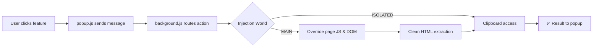

<div align="center">

# WebCopyyy

**Break free from copy restrictions. Unlock, copy, and export any webpage.**
<br><br>


<br>
<br><hr>

*A premium Chrome extension that removes copy/paste restrictions, re-enables right-click and text selection, and lets you export page content as clean formatted text — ready for Google Docs, Word, or anywhere.*

<br>

<a href="#-features">Features</a> · <a href="#-installation">Installation</a> · <a href="#-usage">Usage</a> · <a href="#%EF%B8%8F-architecture">Architecture</a> · <a href="#-permissions">Permissions</a>

---

</div>

## ✨ Features

| Feature | Description |
|:--------|:------------|
| 🔓 **Unlock Page** | Strips `user-select: none`, removes `oncopy`/`oncontextmenu` handlers, and patches `addEventListener` to prevent re-locking |
| 📋 **Copy Formatted** | Copies page content as **clean rich text** — headings, links, lists, tables preserved. No backgrounds, no junk styles |
| 📝 **Export to Google Docs** | One-click: copies formatted content to clipboard and opens a new Google Doc. Just `Ctrl+V` |
| 💾 **Save Page Copy** | Downloads the full page as a self-contained `.html` file with absolute URLs and working links |
| 🧹 **Remove Overlays** | Kills modal popups, cookie banners, paywalls, and scroll-blocking overlays. Restores scroll and removes content blur |

<br>

<div align="center">

### 📸 Preview


<sub>Dark-themed popup with glassmorphism UI — auto-detects page restrictions</sub>

</div>

<br>

## 🚀 Installation

### From Source (Developer Mode)

```bash
# 1. Clone the repo
git clone https://github.com/reusRIFX/WebCopyyy.git

# 2. Open Chrome Extensions
#    Navigate to chrome://extensions/

# 3. Enable "Developer mode" (top-right toggle)

# 4. Click "Load unpacked" → select the WebCopyyy folder
```

> [!TIP]
> Pin the extension to your toolbar for quick access — click the puzzle icon in Chrome's toolbar and pin **WebCopyyy**.

<br>

## 🎯 Usage

### Unlock a Restricted Page

1. Visit any website that blocks copying or right-click
2. Click the **WebCopyyy** icon in your toolbar
3. Toggle the **lock switch** → page is instantly unlocked
4. Select text, right-click, copy — everything works

### Copy with Formatting

1. Click **Copy Formatted** → clean rich text is copied to clipboard
2. Paste into Google Docs, Word, Notion, or any rich text editor
3. Headings, links, bold/italic, lists, and tables are preserved
4. No backgrounds, no visual junk — just clean content

### Export to Google Docs

1. Click **Export to Docs**
2. Content is automatically copied to clipboard
3. A new Google Doc opens in a new tab
4. Press `Ctrl+V` (or `Cmd+V` on Mac) to paste

### Remove Annoying Overlays

1. Click **Remove Overlays**
2. Modals, cookie banners, paywalls, and subscription popups are removed
3. Scroll is restored, content blur is cleared

<br>

## 🏗️ Architecture

```
WebCopyyy/
├── manifest.json          # Extension config (MV3)
├── background.js          # Service worker — message routing, state management, injection
├── icons/
│   ├── icon16.png
│   ├── icon32.png
│   ├── icon48.png
│   └── icon128.png
└── popup/
    ├── popup.html         # Extension popup UI
    ├── popup.css          # Dark theme, glassmorphism, animations
    └── popup.js           # Popup controller — toggle state, feature buttons
```

### How It Works Under the Hood



**Key design decisions:**

- **MAIN world injection** for unlock and content extraction — required to override page-level JavaScript event listeners and access computed styles
- **ISOLATED world injection** for clipboard writes — the `clipboardWrite` permission grants access here without needing a user gesture
- **`chrome.storage.session`** for tracking unlock state per tab — automatically clears when browser closes
- **Data URIs** for page downloads — `URL.createObjectURL` doesn't exist in MV3 service workers
- **Recursive DOM sanitizer** for copy — walks the tree keeping only semantic tags (`h1-h6`, `p`, `a`, `strong`, `em`, `ul`, `ol`, `li`, `table`, `img`, `blockquote`, `pre`, `code`), stripping all styles

<br>

## 🔒 Permissions

| Permission | Why |
|:-----------|:----|
| `activeTab` | Access only the tab the user explicitly clicks on |
| `scripting` | Inject content scripts to unlock pages and extract content |
| `storage` | Remember which tabs are unlocked (`chrome.storage.session`) |
| `downloads` | Save page copies as `.html` files |
| `clipboardWrite` | Write formatted content to clipboard from content scripts |

> [!NOTE]
> WebCopyyy uses **`activeTab`** instead of broad host permissions. It can only interact with the page you're currently viewing, and only when you explicitly click the extension icon.

<br>

## 🛡️ Smart Restriction Detection

When you open the popup, WebCopyyy automatically scans the page for:

- CSS `user-select: none` on body and content elements
- Inline `oncopy`, `oncontextmenu`, `onselectstart` handlers
- Event handler attributes on `<body>` and `<html>`

If **no restrictions are detected**, the toggle shows _"No Restrictions — This page allows copying freely"_ and disables itself, so you know at a glance whether the extension is needed.

<br>

## 🎨 Design

- **Dark theme** with glassmorphism effects
- **Inter font** for premium typography
- **Ambient orb animations** for visual depth
- **Indigo-to-purple gradient** (`#667eea` → `#764ba2`) brand accent
- **Spring-physics animations** for smooth micro-interactions
- **Color-coded feature buttons** — indigo (copy), Google blue (docs), purple (save), rose (overlays)

<br>

## 🧩 Compatibility

| Browser | Supported |
|:--------|:---------:|
|  | ✅ |
|  | ✅ |
|  | ✅ |
|  | ✅ |
|  | ❌ |
|  | ❌ |

<br>

## 📋 Changelog

### v1.0.0

- 🔓 Page unlock with CSS override + event listener patching
- 📋 Copy Formatted — clean semantic HTML to clipboard
- 📝 Export to Google Docs — one-click workflow
- 💾 Save Page Copy as `.html` with absolute URLs
- 🧹 Remove Overlays — smart detection by area, z-index, and class patterns
- 🔍 Auto-detection of copy restrictions on popup open
- 🎨 Premium dark UI with glassmorphism and animations

<br>

## 📄 License

MIT © [rif-x43](https://github.com/rif-x43)

---

<div align="center">

**Built with 🤍 by [rif-x43](https://github.com/rif-x43)**

<sub>If WebCopyyy helped you, consider giving it a ⭐</sub>

</div>
